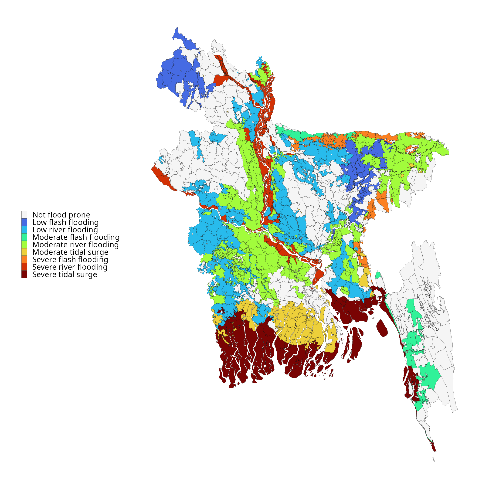

# BDHS Geolocation and Climate Impact Analysis

## Overview
This repository contains the research, data pipelines, and spatial analysis linking Bangladesh Demographic and Health Survey (BDHS) geolocation data with high-resolution climate and environmental datasets. 

The primary objective of this project is to investigate the relationship between historical climate variables (such as temperature, precipitation, and extreme weather events) and  health outcomes, e.g., child mortality, nutritional status,  infectious diseases, maternal health across varying geographic clusters in Bangladesh.

## Data Sources
* **Health & Demographic Data:** [The DHS Program](https://dhsprogram.com/) (BDHS datasets). Includes historical survey data linked to GPS clusters (villages/urban blocks).
* **Climate Data:** [World Bank Climate Change Knowledge Portal](https://climateknowledgeportal.worldbank.org/). 
* Primary dataset: `era5-x0.25` (ERA5 0.25-degree resolution) for historical temperature and precipitation reanalysis.
* Secondary datasets: [List any others you end up using, e.g., CHAZ for cyclones].

## Analysis 

### Maps 

{fig-align="center" width="85%"}